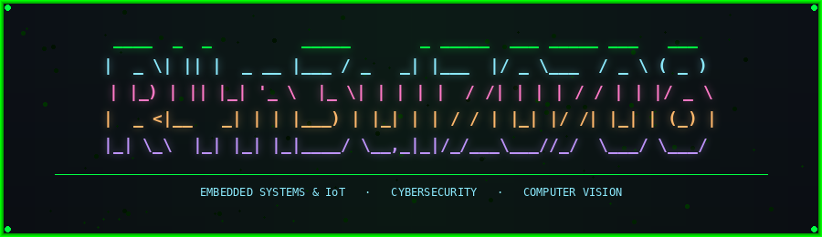

<div align="center">




<br/><br/>

[](https://git.io/typing-svg)

</div>

---

## whoami

```python
class Laurent:
    name     = "Laurent Kpessou N. VOGNITO"
    alias    = "R4n3ul7_0708"
    school   = "IFRI — Université d'Abomey-Calavi"
    degree   = "Licence Professionnel Systèmes Embarqués & IoT (L2)"
    email    = "vognitolaurent@gmail.com"

    focus    = [
        "IoT Security & Embedded Systems",
        "Reverse Engineering & Binary Exploitation",
        "Computer Vision on constrained hardware",
        "Web Pentesting & CTF"
    ]

    goal     = "Expert en cybersécurité des systèmes embarqués et IoT"
```

---

## 🛠️ Stack & Compétences

### Langages


-000000?style=flat-square&logo=assemblyscript&logoColor=white)
-000000?style=flat-square&logo=rust&logoColor=white)


### Cybersécurité


### IA & Data


### Systèmes Embarqués & IoT


### Dev & Outils

-41CD52?style=flat-square&logo=qt&logoColor=white)


---

## 🚀 Projets

### 🔍 PhishAnalyzer AI
> Outil web d'analyse de phishing — détecte les liens suspects et emails malveillants, génère un rapport PDF complet.

`Python 3` · `Django` · `BeautifulSoup` · `VirusTotal API` · `Cohere/OpenAI` · `Tailwind CSS`

---

### 🤖 Spam Detector
> Algorithme de détection de spam entraîné avec Scikit-learn, classification ML sur corpus d'emails.

`Python` · `Scikit-learn` · `NLP` · `Pandas`

---

## 🏆 Événements & Certifications

| Événement | Date | Lieu |
|---|---|---|
| **Deep Learning Indabax Benin 2025** | Dec 2025 | Abomey-Calavi |
| **NASA Space Apps Challenge** | Oct 2025 | Cotonou |
| **Finale HACKERLAB 2025** | Jun 2025 | Cotonou |
| **Hackathon Hack4IFRI** | 2024–2025 | IFRI |

**Certifications :** CCEP (Red Team Leaders) · NASA Galactic Problem Solver · Intro to Cybersecurity (Cisco) · Python (HackerRank, DataCamp, Sololearn) · Intermediate Python (DataCamp)

---

## 📊 Statistiques GitHub

<br/>

<div align="center">


</div>

<br/>

<div align="center">


</div>
<br/>
<div align="center">


| Stat | Valeur |
|------|--------|
| 📁 Repositories |  |
| ⭐ Stars reçues |  |
| 👥 Followers |  |
</div>

---

## 🎯 Objectif

> Devenir **expert en cybersécurité des systèmes embarqués et IoT** —
> maîtriser le reverse engineering firmware, le pentest IoT hardware,
> et la vision par ordinateur appliquée à la sécurité.
> De l'assembleur jusqu'aux réseaux de neurones.

---

## 🌐 Contacts

<div align="center">

[](https://www.linkedin.com/in/laurent-vognito-a71750328)
[](https://x.com/vognito44454)
[](https://medium.com/@R4n3ul7_0708)
[](https://discord.gg/laurent06341)
[](https://app.hackthebox.com/users/2144397)
[](mailto:vognitolaurent@gmail.com)
[](https://r4n3ul70708.me)

</div>

---

<div align="center">


*"Security is not a product, it's a process."*

</div>